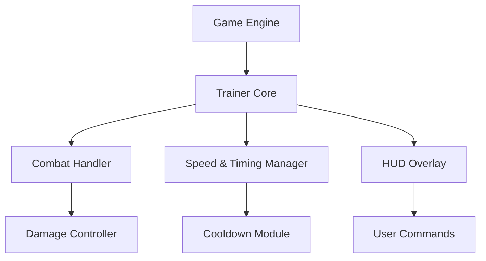

# The Lacerator Trainer ⚔️

The **Lacerator Trainer** is an advanced gameplay enhancement suite built for players who crave absolute control over combat flow, timing, and progression. Designed for precision tuning, it empowers you to modify health, stamina, attack speed, and skill cooldowns dynamically — all in real time.

Whether you’re testing boss mechanics, refining combos, or experimenting with high-damage builds, this trainer provides a streamlined way to practice and perfect your style.

---

## 🧭 Overview

The **Lacerator Trainer** integrates with the game’s runtime systems to deliver seamless parameter adjustments that don’t interfere with core data or save integrity. Its modern overlay interface lets you fine-tune mechanics mid-battle, adjust difficulty, and even alter animation speeds for combat practice.

[!IMPORTANT]

> The trainer uses safe memory interaction — no file editing, injection instability, or permanent alterations to your data.


---

## ⚙️ Core Features

* **💀 Infinite Health Mode:** Focus purely on mastering mechanics without restarts.
* **🩸 Attack Multiplier:** Scale up your melee or ranged power instantly.
* **💨 Speed & Reflex Booster:** Modify character speed for dodge timing and combo precision.
* **⏱ Cooldown Manager:** Remove or reduce skill cooldowns for smoother combo chains.
* **🔥 Rage Mode Toggle:** Activate burst power boosts or invulnerability phases manually.
* **🎮 HUD Overlay Controls:** Adjust features with on-screen toggles and live stats.

Example Config:

```ini
[TRAINER_CONFIG]
InfiniteHealth=True
StaminaRegen=Fast
AttackMultiplier=2.0
SpeedBoost=1.3
CooldownReduction=0.5
RageMode=True
```

[!NOTE]

> You can save and switch between multiple `.cfg` files located in `/TheLacerator/config/`.

---

## 🧰 Setup & Usage

1. **Download** the verified build.
2. **Extract** the contents into your *The Lacerator* directory.
3. **Run** `LaceratorTrainer.exe` as Administrator.
4. **Launch the game**, then press `F1` to open the overlay.
5. **Use arrow keys** or **controller D-pad** to toggle features.

Command Example:

```bash
LaceratorTrainer.exe /profile="CombatLab.cfg"
```

[!WARNING]

> Always open the trainer **before** entering combat or boss zones to ensure full synchronization with active entities.

---

## 💻 Compatibility

| Platform         | Status | Notes                        |
| ---------------- | ------ | ---------------------------- |
| Windows 10/11    | ✅      | Fully supported              |
| Steam Version    | ✅      | Auto-process attach          |
| Epic Games       | ⚙️     | Manual attach                |
| Controller Input | ✅      | Overlay navigation supported |
| Offline Mode     | ✅      | Fully functional             |

Accessibility: adjustable color schemes, font scaling, and minimal overlay mode for distraction-free sessions.

---

## 🧩 System Flow Diagram



---

## 🧠 Preset Examples

**Training Mode (Mechanic Mastery)**

```ini
[PRESET_TRAINING]
InfiniteHealth=True
AttackMultiplier=1.0
SpeedBoost=1.2
CooldownReduction=0.3
RageMode=False
```

**Berserk Mode (High Power)**

```ini
[PRESET_BERSERK]
InfiniteHealth=False
AttackMultiplier=3.5
SpeedBoost=1.4
CooldownReduction=0.1
RageMode=True
```

**Explorer Mode (Story Focus)**

```ini
[PRESET_EXPLORER]
InfiniteHealth=True
AttackMultiplier=1.2
SpeedBoost=1.1
CooldownReduction=0.8
RageMode=False
```

Switch instantly between presets with `F2`, `F3`, and `F4`.

---

## 💬 FAQ

**Q: Is it safe for long sessions?**
A: Yes — the trainer automatically resets parameters when the game exits.

**Q: Can it be used alongside graphics mods or reshades?**
A: Yes, the overlay renders independently from shader layers.

**Q: Does it affect achievements or progression?**
A: No, the trainer works externally and doesn’t modify save flags.

**Q: Can I record gameplay while it’s active?**
A: Absolutely — it’s OBS and NVIDIA ShadowPlay compatible.

**Q: How often are patches released?**
A: Updates drop every 10–14 days with new offset and engine support.

---

## 🚀 Feature Roadmap

| Version | Feature                     | Status     |
| ------- | --------------------------- | ---------- |
| v1.5    | Rage Timer HUD              | ✅ Released |
| v1.6    | Adaptive Difficulty Curve   | 🚧 Testing |
| v1.7    | Slow-Motion Finisher Toggle | 🧩 Planned |

---

## 🏁 Final Thoughts

The **Lacerator Trainer** is built for those who want to refine combat mastery, analyze AI patterns, or simply unleash full creative power. With its precise controls and intuitive overlay, it transforms every encounter into an opportunity for experimentation, practice, or pure fun.

Dominate the field. Break the limits. Train without fear.

---
